# Smart Inventory Manager

> A Django-based inventory management platform with AI-powered demand forecasting for retail marketplaces. Built as a Final Year Project at UET Taxila (2020–2024).

## Demo

https://github.com/user-attachments/assets/678850a8-b411-4640-b6f3-e5e70eaba8c1

## Screenshots

| | |
|---|---|
| 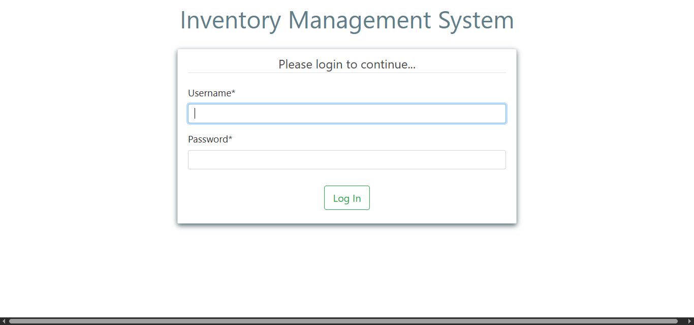 | 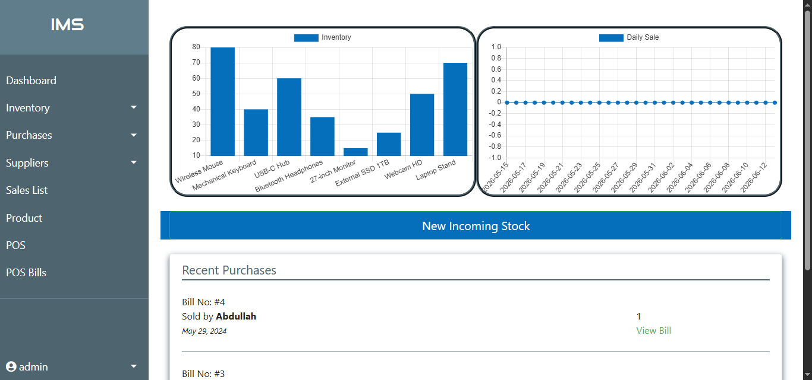 |
| 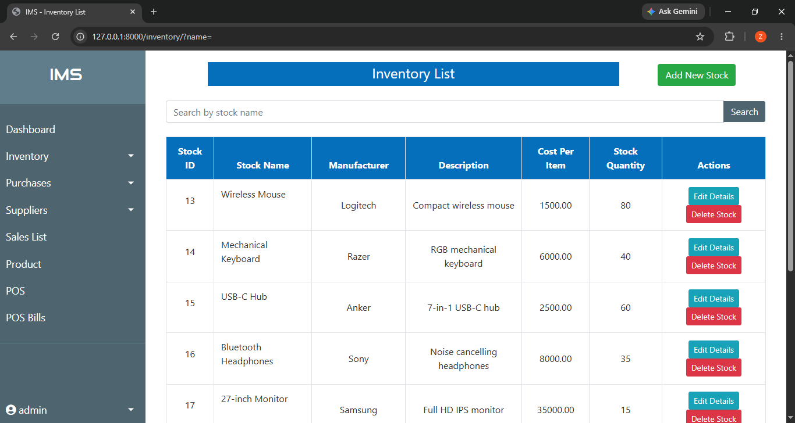 | 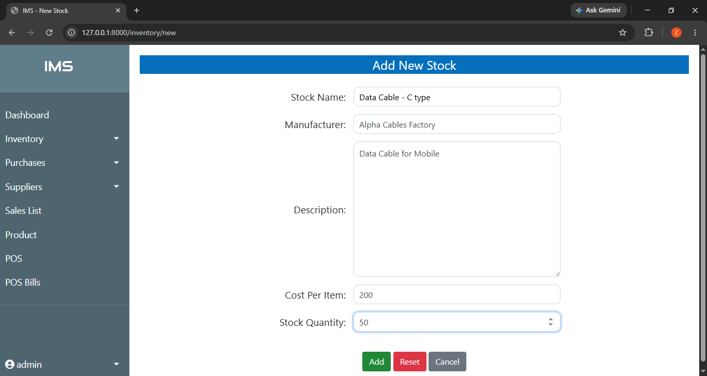 |
| 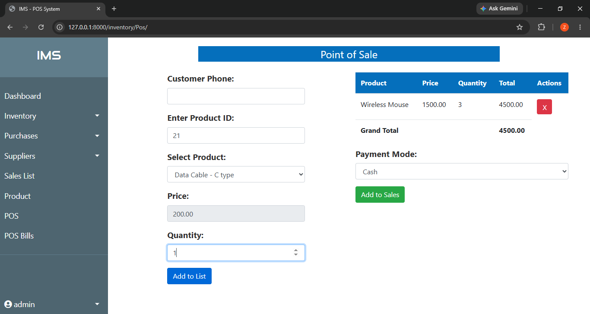 | 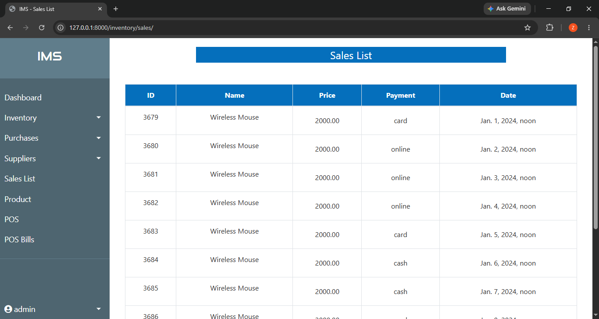 |
| 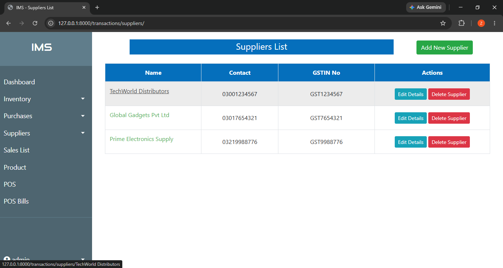 | 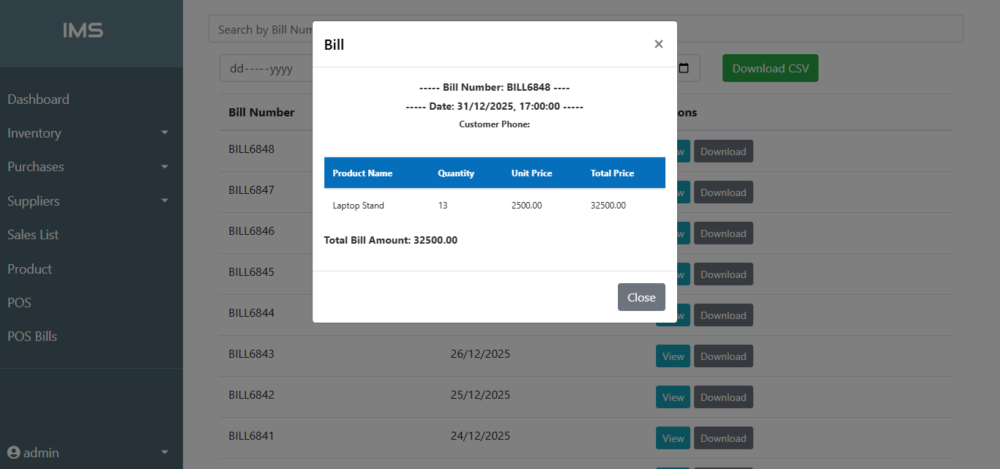 |

### AI Demand Forecasting
*Select a product and prediction period — Prophet generates a demand forecast with holiday effects (New Year, Black Friday, Christmas) and IQR-based outlier handling.*

| | |
|---|---|
| 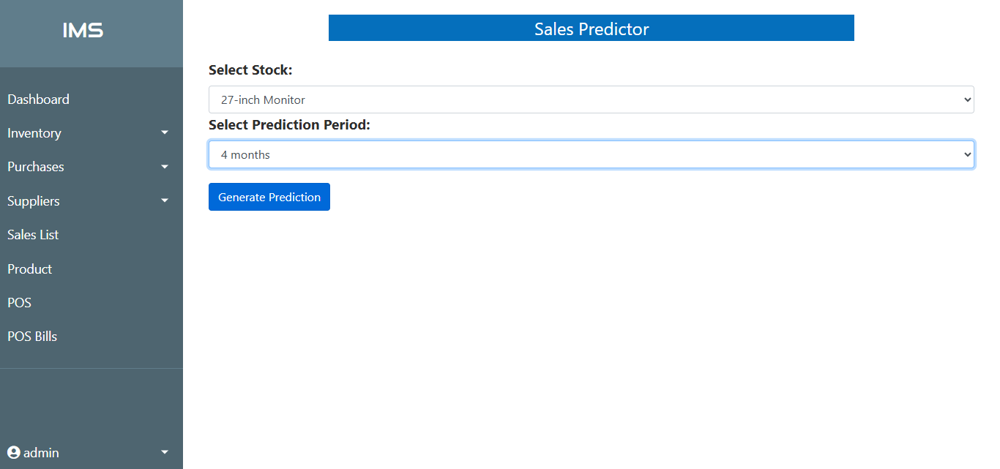 | 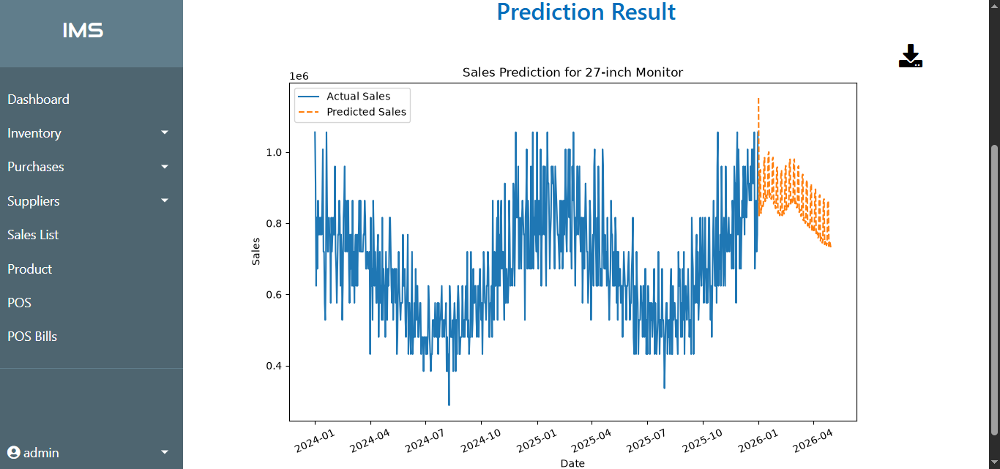 |

## Features

- **Role-based authentication** — Admin has full system access; Employees are restricted to POS and sales functions
- **Inventory management** — Add, update, delete stock with automatic low stock alerts
- **Supplier management** — Maintain supplier records and track purchase orders
- **Point of Sale (POS)** — Employee-facing interface for recording customer purchases with real-time inventory updates
- **Sales reports** — Generate and export sales data as CSV between any date range
- **AI demand forecasting** — Prophet-based time-series forecasting per product with configurable prediction periods (15 days to 4 months)

## System Design

| Use Case Diagram | ERD |
|---|---|
| 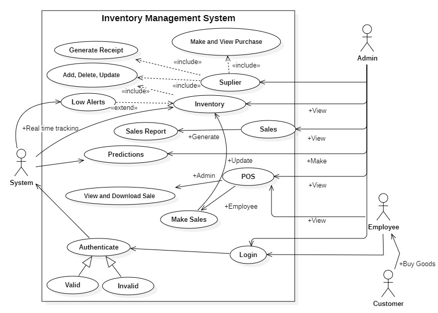 | 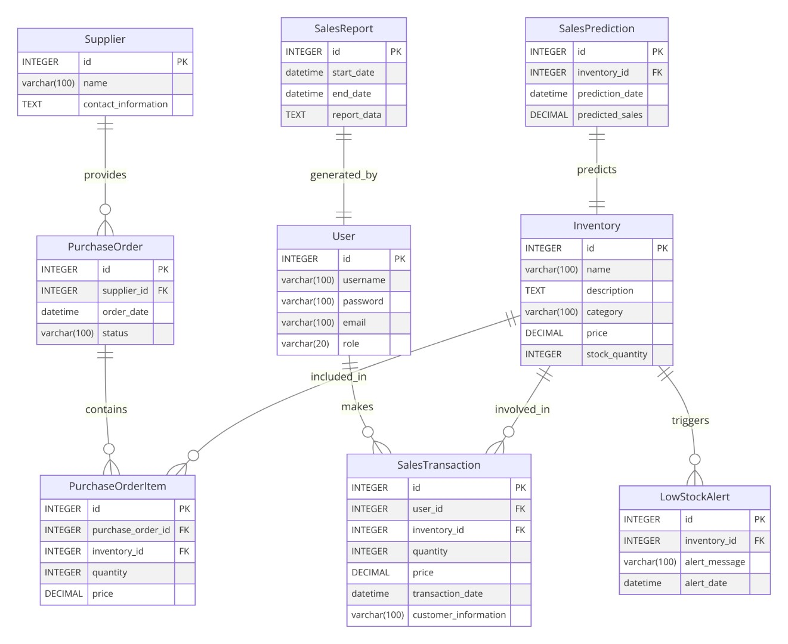 |

*Use case diagram shows actor-level access control. ERD covers inventory, sales transactions, suppliers, purchase orders, and forecasting entities.*

Class Diagram

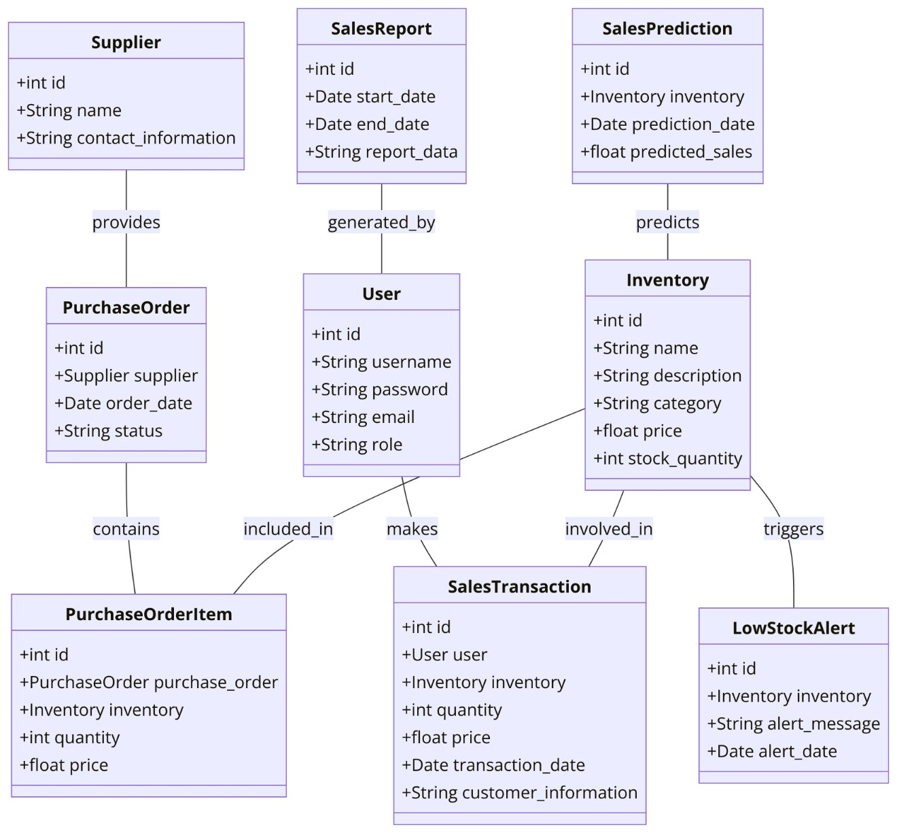

## Tech Stack

| Layer | Technologies |
|---|---|
| Backend | Python, Django |
| Forecasting | Prophet, Pandas, Matplotlib |
| Database | SQLite |
| Frontend | Bootstrap, HTML, CSS, JavaScript |

## Forecasting Model

Model selection, evaluation, and comparison of 12 forecasting approaches (ARIMA, SARIMA, Prophet, LSTM variants, CNN) is documented in detail in the companion repo:

**[sales-forecasting-model-comparison](https://github.com/ZainAli-2001/sales-forecasting-model-comparison)**

Prophet with holiday effects was selected for production use — achieving **22.62% MAPE** while offering simpler deployment and faster training compared to LSTM variants.

## Project Context

Final Year Project — BS Computer Science, UET Taxila (2020–2024).

| Contributor | Role |
|---|---|
| Zain Ali Abidi | Data analysis, forecasting model development & integration |
| Abdullah | Django web application development |

> Source code is private. This repo showcases the system design, features, and output.
